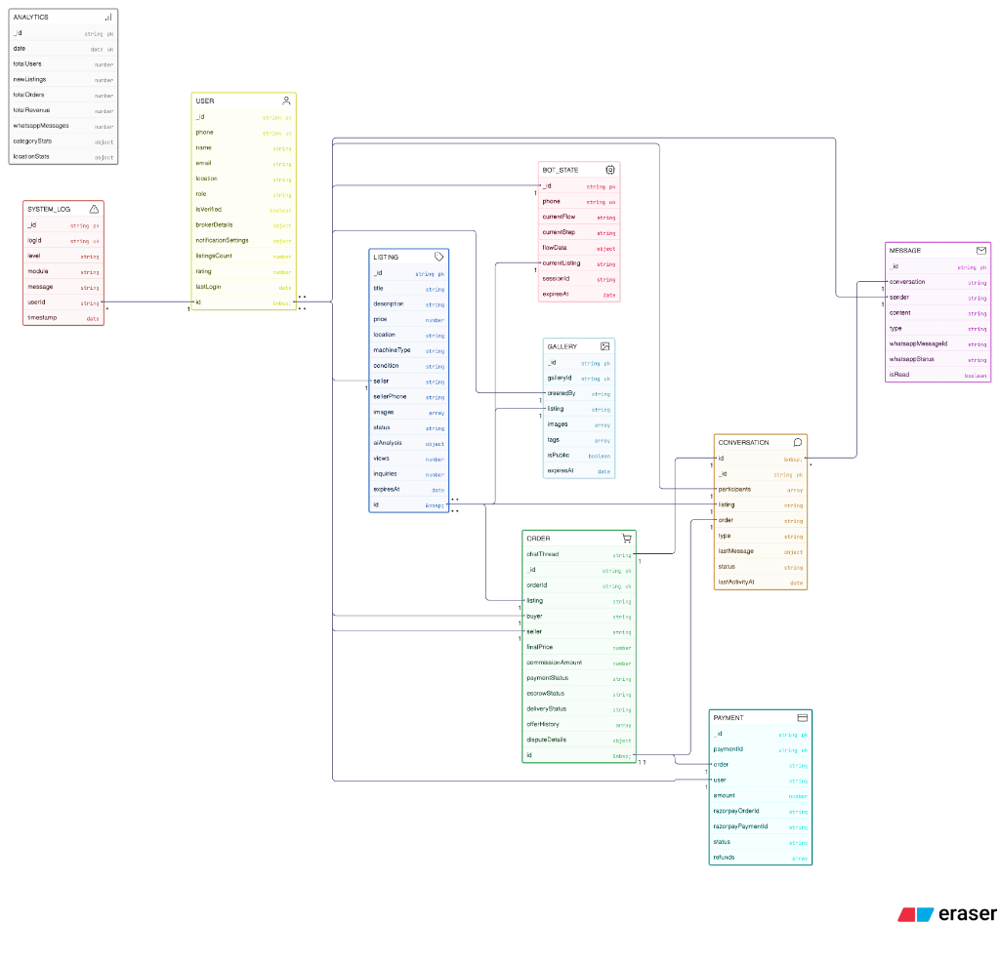

# 🚜 MachineryMart

<div align="center">


**India's First WhatsApp + AI Powered Machinery Marketplace**

[Live Demo](#) • [Documentation](#features) • [Report Bug](https://github.com/yourusername/machinery-mart/issues)

</div>

---

## 📖 About

MachineryMart is an AI-powered marketplace for buying and selling heavy machinery, tractors, excavators, and farm equipment. Built with modern technologies, it features WhatsApp integration for seamless communication and AI-powered valuation for instant pricing.

### ✨ Key Features

- 🤖 **AI-Powered Valuation** - Get instant machine pricing using image analysis
- 💬 **WhatsApp Integration** - List and browse machinery via WhatsApp
- ✅ **Verified Sellers** - KYC verified sellers for trust
- 🔒 **Escrow Protection** - Secure payments with buyer protection
- 📊 **Price Analytics** - Smart pricing based on market trends
- 📱 **Responsive Design** - Works on all devices

---

## 🛠️ Tech Stack

### Backend
| Technology | Purpose |
|------------|---------|
| Node.js | Runtime Environment |
| Express 5 | Web Framework |
| TypeScript | Type Safety |
| MongoDB | Database |
| JWT | Authentication |
| Winston | Logging |

### Frontend
| Technology | Purpose |
|------------|---------|
| React 19 | UI Library |
| Vite | Build Tool |
| TypeScript | Type Safety |
| Tailwind CSS 4 | Styling |
| TanStack Query | Server State |
| Zustand | Client State |

---

## 🚀 Getting Started

### Prerequisites

- Node.js >= 18.0.0
- npm >= 9.0.0
- MongoDB (local or Atlas)

### Installation

1. **Clone the repository**
   ```bash
   git clone https://github.com/yourusername/machinery-mart.git
   cd machinery-mart
   ```

2. **Install all dependencies**
   ```bash
   npm run install:all
   ```

3. **Set up environment variables**
   
   Backend (`backend/.env`):
   ```env
   PORT=3000
   NODE_ENV=development
   MONGODB_URI=mongodb://localhost:27017/machinery
   JWT_SECRET=your_super_secret_key_here
   JWT_EXPIRES_IN=7d
   CORS_ORIGIN=http://localhost:5173
   ```

   Frontend (`frontend/.env`):
   ```env
   VITE_API_URL=http://localhost:3000/api
   ```

4. **Start development servers**
   ```bash
   npm run dev:all
   ```

   This runs both frontend and backend concurrently:
   - Frontend: http://localhost:5173
   - Backend: http://localhost:3000

---

## 🗄️ Database Schema

### Entity Relationship Diagram



### Models (10 Collections)

| Model | Purpose |
|-------|---------|
| **User** | Users, Brokers, Admins with phone-based auth |
| **Listing** | Machinery listings with AI analysis |
| **Order** | Transactions with escrow & negotiation |
| **Conversation** | Chat threads between users |
| **Message** | Individual messages with WhatsApp status |
| **Payment** | Razorpay integration & refunds |
| **BotState** | WhatsApp bot flow state machine |
| **Gallery** | Image management with AI labels |
| **Analytics** | Daily platform metrics |
| **SystemLog** | Application logs (90-day TTL) |

---

## 📁 Project Structure

```
machinery-mart/
├── backend/                 # Express.js API
│   ├── src/
│   │   ├── config/         # Configuration files
│   │   ├── controllers/    # Route controllers
│   │   ├── middleware/     # Custom middleware
│   │   ├── models/         # Mongoose models
│   │   ├── routes/         # API routes
│   │   ├── services/       # Business logic
│   │   ├── utils/          # Utility functions
│   │   └── index.ts        # Entry point
│   ├── tests/              # Backend tests
│   └── package.json
│
├── frontend/               # React + Vite app
│   ├── src/
│   │   ├── components/     # Reusable components
│   │   ├── pages/          # Page components
│   │   ├── hooks/          # Custom hooks
│   │   ├── services/       # API services
│   │   ├── store/          # Zustand stores
│   │   └── App.tsx         # Root component
│   └── package.json
│
├── docs/                   # Documentation & diagrams
├── package.json            # Root package.json
├── .gitignore
└── README.md
```

---

## 📜 Available Scripts

### Root Directory

| Command | Description |
|---------|-------------|
| `npm run dev:all` | Start both frontend & backend |
| `npm run dev:backend` | Start backend only |
| `npm run dev:frontend` | Start frontend only |
| `npm run build:backend` | Build backend for production |
| `npm run build:frontend` | Build frontend for production |
| `npm run install:all` | Install all dependencies |

### Backend

| Command | Description |
|---------|-------------|
| `npm run dev` | Development server with hot-reload |
| `npm run build` | Compile TypeScript |
| `npm start` | Production server |

### Frontend

| Command | Description |
|---------|-------------|
| `npm run dev` | Development server |
| `npm run build` | Production build |
| `npm run preview` | Preview production build |

---

## 🔌 API Endpoints

### Health Check
```
GET /api/health
```

### Authentication (Coming Soon)
```
POST /api/auth/register
POST /api/auth/login
GET  /api/auth/me
```

### Machines (Coming Soon)
```
GET    /api/machines
POST   /api/machines
GET    /api/machines/:id
PUT    /api/machines/:id
DELETE /api/machines/:id
```

---

## 🗺️ Roadmap

- [x] Project setup & scaffolding
- [x] Basic frontend with Tailwind CSS
- [ ] MongoDB integration
- [ ] User authentication (JWT)
- [ ] Machine CRUD operations
- [ ] Image upload & storage
- [ ] AI-powered image analysis
- [ ] WhatsApp Business API integration
- [ ] Payment gateway integration
- [ ] Admin dashboard

---

## 🤝 Contributing

Contributions are welcome! Please feel free to submit a Pull Request.

1. Fork the project
2. Create your feature branch (`git checkout -b feature/AmazingFeature`)
3. Commit your changes (`git commit -m 'Add some AmazingFeature'`)
4. Push to the branch (`git push origin feature/AmazingFeature`)
5. Open a Pull Request

---

## 📄 License

This project is licensed under the MIT License - see the [LICENSE](LICENSE) file for details.

---

## 📬 Contact

**Narendra Mali**

Project Link: [https://github.com/Naren7874/Machinex.git](https://github.com/Naren7874/Machinex.git)

---

<div align="center">

Made with ❤️ in India

⭐ Star this repo if you find it helpful!

</div>
